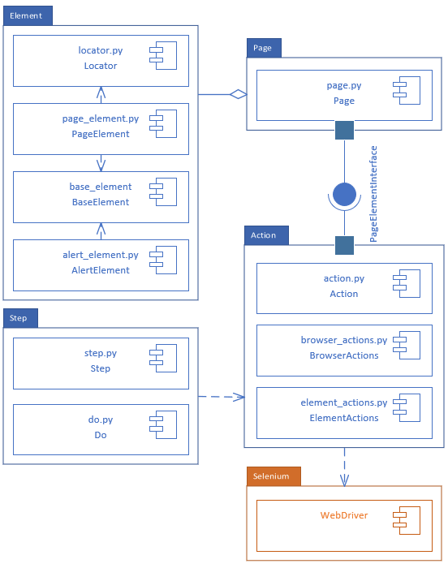

[](https://travis-ci.org/erik-whiting/LuluTest)
# LuluTest
LuluTest is an open source browser automation framework using Python and Selenium.
It is relatively lightweight in that it mostly provides wrappers for 3rd party library methods that make browser automation and testing more intuitive.
The ultimate goal of LuluTest is to get people writing robust automated browser scripts quickly by abstracting out the inherent complexities and peculiarities

## Special Thanks
The following Github users have contributed in some way to LuluTest and I want to thank them so much for their time, effort, and skill.

@wangonya

@benjifs

@alwinaind

@ddrm86

@MarioHdpz

@FarhiaM

@CarolinaKinetic


## Basic Usage

LuluTest is designed to support both white and black box testing. The functions
provided will work as long as the machine running the scripts can access the pages
under test. 

The basic work flow for creating a test is as such:

1. Create a `Page` object with the URL of the page to be tested.
2. Create an `Action` object which will interact with elements
3. Create an `Element` object for each element on the page that will be tested
4. `go` to the page to be tested
5. Create a `Steps` object of actions to take on a page
6. `Do` the `Steps`
7. Do your assertions

### Example Usage
Below is an example test case:

```python
import unittest

from LuluTest.lulu_exceptions import PageNotLoadedError
from LuluTest.page import Page
from LuluTest.element import PageElement
from LuluTest.action import Action
from step import Step, Do, DoStep, Steps


class ExampleTest(unittest.TestCase):
    def test_write_and_click(self):
        page = Page('http://erikwhiting.com/newsOutlet')
        actions = Action()
        page.elements = [
            PageElement(("id", "sourceNews"), "input box"),
            PageElement(("id", "transmitter"), "button"),
            PageElement(("id", "en1"), "english div")
        ]
        actions.go(page)
        actions.input_text(page.get_element("input box"), "Hello")
        actions.click(page.get_element("button"))
        english_div = page.get_element("english div")
        english_text = actions.check_element_text(english_div, "Hello")
        self.assertTrue(english_text)
        actions.close()

```

Alternatively, you can also build pages via either YAML or JSON and import
them for use. For example, the above page can be modeled in `newso_outlet.yml`
like such:
```yaml
page:
  url: http://erikwhiting.com/newsOutlet
  elements:
    input_box:
      id: sourceNews
    button:
      id: transmitter
    english_div:
      id: en1
```
import this file into your test script to avoid writing element finding code:
```python
# In a setup method:
base_path = os.getcwd()
prebuilt_pages_directory = base_path + '/fixtures/pages/'
page_configs = [
    prebuilt_pages_directory + 'news_outlet.yml',
    prebuilt_pages_directory + 'other_page.yml',
    prebuilt_pages_directory + 'even_another_page.json',
]
pages = page_factory.generate_pages(page_configs)

# Now all subsequent tests have access to this page object
def test_basic_usage(self):
    page = self.pages['news_outlet']
    actions = Action()
    actions.go(page)
    actions.input_text(page.get_element("input_box"), "Hello")
    actions.click(page.get_element("button"))
    english_div = page.get_element("english_div")
    english_text = actions.check_element_text(english_div, "Hello")
    self.assertTrue(english_text)
    actions.close()
```
## Features

There are two main design philosophies driving the development of LuluTest:

1. Hide the tedium and peculiarities inherent in browser automation
from the test scripts themselves, allowing testers to write efficient
and robust tests faster

2. Simplify the test writing process as much as possible so non-technical
users can contribute basic test cases while freeing technical
users to focus on more technically complex issues.

These philosophies are implemented mostly by keeping the sometimes slow
response time of web elements in mind. The project aims to avoid
explicit waits and sleeps as much as possible.

## LuluTest Architecture

Between December of 2019 and January of 2020, the LuluTest architecture
was redesigned with better principles and implemented in a way as described
in the picture below. If contributing, please do your best to adhere to the
intended arhcitecture.



## Future Work

The ultimate goal of LuluTest is to power a *domain specific language* to help
facilitate communication between business and technical stakeholders about
requirements and testing.

## Contribution Guide

Please see the [Contribution Guide](./CONTRIBUTING.md)

## Set-Up Guide
For setting up a local environment to contribute to testing, please go to the [Set-Up Guide](./SETUP.md)
